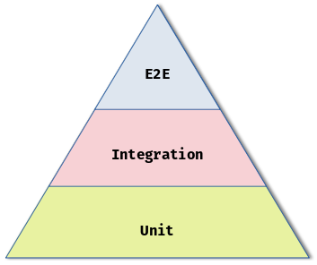
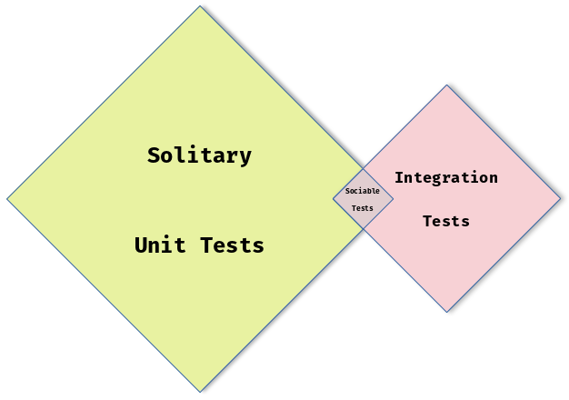

# The Venn of Angular Component Testing

In my experience there is confusion between what I would consider a Unit Test and an Integration Test for an Angular Component. Drawing on my OO development experience and having practised Test-driven development for a number of years in Angular & Java (plus other languages & frameworks), I think I can help reduce the 'grey' in the landscape.

This series is limited to just testing of Angular Components. I feel the concept of Unit Testing other Angular objects, such as Services is more well defined.

## To Start

### A Definition of a Unit Test

> Asserts a unit of software works as expected **within isolation**

### A Definition of an Integration Test

> Asserts a unit of software interacts as expected **with another**

### What is the 'Unit' of a Unit Test?

The smallest piece of software where, for a given change to an input there is an observed (to the software / unit under test) change in output. For example a public method, which for a given input leads to a predictable, visible output (to the software / unit under test).

## A Comparison between a Unit Test & Integration Test

| Aspect            | 🧩 Unit Tests           | 🤝 Integration Tests      |
|-------------------|-------------------------|---------------------------|
| **Scope**         | 🔬 Isolated Units       | 🌐 Component Interactions |
| **Dependencies**  | 🧪 Mocked Dependencies  | 🛠️ Real or Mocked         |
| **Purpose**       | ✅ Isolated Code        | 🔄 Component Integration  |
| **Coverage**      | 💯 High Unit Coverage   | 🚀 Critical Integration   |
| **Fragility**     | 🪨 Resilient            | 🍌 More Fragile           |
| **Speed**         | 🚤 Fast                 | ⛵ Slower                 |
| **On Failure**    | 🎯 Easy to pinpoint     | 👓 Potentially harder     |

In summary, Unit Tests target small, isolated units of code without external dependencies, while Integration Tests examine the interactions and interfaces between components or services.

## How do these Relate to Angular Component Testing?

I think this where the lines blur between what [I would consider] a unit vs an integration test is. An Angular Component consists of:

> * An HTML template that declares what renders on the page
> * A TypeScript class that defines behavior [sic]
> * A CSS selector that defines how the component is used in a template
> * Optionally, CSS styles applied to the template
>
> -- <cite>[Angular Guide - Angular components overview](https://angular.io/guide/component-overview#angular-components-overview)<cite>

I ask you this question:

> What is *'Isolation'* or the *Unit Under Test* in the Context of an Angular Component?

1. I think if your test focuses on the **class** of a single Angular component in isolation, it's more likely to be a unit test.
2. If your test involves **rendering multiple Angular components together**, in a more real-world scenario, and / or **interacting with the DOM[^1]**, I think it is probably an Integration Test[^2].

## An example

For example, testing the click of a button on a component:

1. `component.onClick();` (assuming this is what the `onclick` event handler calls)
    * **Type of Test?** 🧩 Unit Test
    * **Why?** Interacting directly with the public interface of the class / unit under test.
2. `fixture.nativeElement.querySelector('button').click();`
    * **Type of Test?** 🤝 Integration Test
    * **Why?** The test interacts with the DOM, so likely needs to render other dependencies and components. One could argue the DOM itself is a dependency[^3].

***But that's not an Integration Test, it's a Component DOM Test!***

You're spot on. If you read the [Angular Guide for testing Components](https://angular.io/guide/testing-components-basics), the docs call the tests 'Component Class Tests' and 'Component DOM Tests', no where does it mention unit testing[^4]. Perhaps the terminology we use day-to-day is wrong? Either way I think this leads to a grey area of what we refer to as 'unit testing' Angular Components. Moreover, here is further definition of an Angular Component:

> ...a component is more than just its class. A component interacts with the DOM and with other components. The class-only tests can tell you about class behavior [sic]. They cannot tell you if the component is going to render properly, respond to user input and gestures, or integrate with its parent and child components.
>
> -- <cite>[Angular Guide - Component DOM testing](https://angular.io/guide/testing-components-basics#component-dom-testing)</cite>

So if Component DOM Tests are to address this 'limitation', that must mean the Component DOM Tests need to have dependencies and 'integrate with its parent and child components'? Sounds pretty close to the [definition of an Integration Test](#a-definition-of-an-integration-test) to me.

I felt there had to be a cleaner, more succinct way to draw the line between Component Unit Tests vs Component DOM Tests vs Integration Tests. This is where I went back to my books[^5] and considered Sociable and Solitary tests.

## Sociable vs Solitary Unit Tests

I think it was Jay Fields that coined the term Sociable & Solitary Tests. Martin Fowler has a [good article](https://martinfowler.com/bliki/UnitTest.html) that mentions the concept too.

> **Solitary** Tests prefer to **isolate** the unit under test.
>
> **Sociable** Tests often **rely on** other units to fulfil the behaviour.

I think this more subtly describes the different approaches to 'unit testing' Angular components most Angular engineers take. Think about this too:

> [A Solitary Unit Test] Never cross boundaries
>
> -- <cite>['Working Effectively with Unit Tests' by Jay Fields](https://leanpub.com/wewut)</cite>

I would consider the interface between the Component Template and the Component Class a boundary. Thus Component DOM Tests must be Sociable.

Distilling this down further, I think this leads us to:

> 🧩 **Component Class Tests =** Solitary Unit Tests
>
> 🤝 **Component DOM Tests =** Sociable / Integration Tests

I fall firmly into the Solitary camp of unit testing approaches: I can probably count on one hand the number of Angular, Sociable Unit Tests I have ever *had* to write.

My predisposition probably comes down to my development background. For example, it's simply not possible to test a WPF UI (or View) binding / interaction with the 'class' (View Model), with the unit test framework, [NUnit](https://nunit.org/). Furthermore, the 'View' should never have any logic anyway. I would argue, for the large part, it should be the same for Angular Templates too!

In addition, the Sociable Tests exhibit traits similar to Integration tests for example: [fragility](#fragility) & [speed](#speed). To better describe this, look at this basic example.

### An Example comparing Solitary & Sociable Angular Component Tests

Take this Angular component as an example.

```typescript
@Component({
  selector: 'app-root',
  template: `
    <button (click)="increment()">Increment</button>
    <p>{{ counterValue }}</p>
  `
})
export class AppComponent {
  @Input() counterValue: number = 0;
  @Output() counterIncremented = new EventEmitter<void>();

  increment() {
    this.counterValue++;
    this.counterIncremented.emit();
  }
}
```

And here are the tests, written in the two different approaches:

<details>
  <summary>1. Solitary Unit Tests</summary>

  ```typescript
  describe('AppComponent - Solitary Unit Tests', () => {
    describe('when the button is clicked', () => {
      it('should increment the counter value', () => {
        const component = new AppComponent();
        component.counterValue = 0;

        component.increment();

        expect(component.counterValue).toBe(1);
      });

      it('should emit an event', () => {
        const component = new AppComponent();

        let emitted = false;
        component.counterIncremented.subscribe(() => {
          emitted = true;
        });

        component.increment();

        expect(emitted).toBe(true);
      });
    });
  });
  ```

</details>

<details>
  <summary>2. Sociable Tests</summary>

  ```typescript
  describe('AppComponent - Sociable Tests', () => {
    let component: AppComponent;
    let fixture: ComponentFixture<AppComponent>;

    beforeEach(() => {
      TestBed.configureTestingModule({
        declarations: [AppComponent],
      });

      fixture = TestBed.createComponent(AppComponent);
      component = fixture.componentInstance;

      fixture.detectChanges();
    });

    it('should display the initial counter value', () => {
      component.counterValue = 5;
      fixture.detectChanges();

      const displayedValue = fixture.nativeElement.querySelector('p').textContent;
      expect(displayedValue.trim()).toBe('5');
    });

    it('should increment the counter when the button is clicked', () => {
      const button = fixture.nativeElement.querySelector('button');
      button.click();

      fixture.detectChanges();

      const displayedValue = fixture.nativeElement.querySelector('p').textContent;
      expect(displayedValue.trim()).toBe('1');
    });
  });
  ```

</details>

Notice how the Sociable Tests are subtly different - A Sociable Test wouldn't normally test the `counterIncremented` event is dispatched. That would be on the responsibility of the parent 'subscriber' (which in turn shouldn't need to know under what circumstances it is emitted).[^6]

Where as the Solitary Unit Tests can be said to provide 100% coverage, the Sociable / Component DOM Tests can not. If you just had the Sociable Tests, you could delete the `this.counterIncremented.emit();` line, which could be critical, and yet no tests would fail. 🙁

Given these examples, let's outline the key differences:

### Key Differences: Solitary vs Sociable Tests

| Aspect               | 🧩 Solitary Test           | 🤝 Sociable / Component DOM Test                         |
|----------------------|----------------------------|----------------------------------------------------------|
| **Scope**            | 🔬 Isolated Units          | 🌐 Component Interaction                                 |
| **Dependencies**     | 🥸 None / Mocked           | 🎨 DOM & Angular Change Detection                        |
| **Purpose**          | 📐 Component Class logic   | 🔄 Verify the Component Class and Template work together |
| **Coverage**         | 💯 High Unit Coverage      | 〽️ Lower Coverage                                        |
| **Fragility**        | 💪 Highly Resilient        | 💀 More Fragile                                          |
| **Speed (100 runs)** | 🚀 **2.2ms Avg**           | 🐌 26.9ms Avg                                               |
| **On Failure**       | 🎯 Easy to Pinpoint        | 🪨 Harder                                                |

#### Fragility

How many times have you added a new component, only to then find some, relatively unrelated suite of tests now fail or you see console warnings? Likely this is because another component test suite, imports an ancestor of your new component. When this happens, you're probably thinking "I know but that ancestor shouldn't care about my new grandchild component". I think you're right. It feels to me like, the ancestor test suite is more like an Integration Test suite, simply because it has a hierarchy of dependencies.

> Sociable Unit Tests are more susceptible to cascading failures.
>
> -- <cite>['Working Effectively with Unit Tests' by Jay Fields](https://leanpub.com/wewut)</cite>

This all comes down to using, the `TestBed` or notably `TestBed.configureTestingModule()`.[^7]

On the other hand, the Solitary Unit Tests can not suffer this same fate: they have zero knowledge of any descendants.

#### Speed

Remember Unit Tests are meant to be fast. They should enable an engineer to be able to run them often, ideally after any change they make. Running two, Sociable Unit Tests in an average of 26.9ms is pretty good right? But how about running tests, that give you more coverage and greater confidence but **12 times faster**? Just scale that up to when you have over 2,000 tests. That's the difference between the entire test run taking 27 seconds (which is still really fast but these are very simple tests) vs 2 seconds! That's what Solitary Unit Tests give you.

If Unit Tests are meant to be fast, then I'll take running 2,000 of them in ~2 seconds please.

Furthermore, I think most engineers find it quicker and easier to write Solitary Unit Tests than they do Sociable Unit Tests (Component DOM Tests), plus maintain the component dependencies in the tests.[^8]

## The Venn Diagram of Angular Component Testing

This brings us to the heart of this series. Going back to the [definition for an Integration Test from part 1 of this series](./venn-of-angular-component-testing-0.md#a-definition-of-an-integration-test):

> [an Integration Test] Asserts a unit of software interacts as expected **with another**

After what I've previously highlighted with Sociable Tests, I think Sociable, Angular Component Tests are actually just a type of *Integration Test*. At the very least there is a significant overlap. Given this, **we should treat and expect Sociable / Component DOM tests to behave as Integration Tests**: they are more fragile & slower.

I'm sure if you've got this far though the series, then you are familiar with the [Testing Pyramid](https://www.smashingmagazine.com/2023/09/long-live-test-pyramid/)?



Here is my take on that but applying a similar principal to Angular, Component Testing.



This highlights the overlap between Unit & Integration Tests when it comes to testing Angular Components and how the 'grey area' of testing *is* the Sociable tests. It also emphasises the ratio (not to scale) of these types of tests I think we should be aiming for.

If I could change three conventions regarding the general testing approach we take in Angular applications, it would be to have:

1. ⏫ Have far more Solitary Unit Tests. Day-to-day I unfortunately see very few of these.

    ```typescript
    it('should test', () => {
      //arrange
      const component = new MyComponent();
      ...
      //act
      ...
      //assert
      expect(component...).toEqual(...);
    })
    ```

2. 🔼 More 'real' Integration Tests, that mimic real customer behaviour & interactions (using tools such as Playwright or Cypress).
3. ⏬ Fewer (near zero) Sociable / Component DOM Test Tests.
   1. Should push engineers to have any logic within the class rather than the template.
   2. If you have to have them, then call them out. Put them in separate `describe('IT Tests'){}` blocks or something similar (and limit the `TestBed` boilerplate to that block).

I think if an applications' test suite is organised in this way, it would lead to improved development practices. Engineers will lean more towards the [DRY](https://en.wikipedia.org/wiki/Don%27t_repeat_yourself) principal and smaller, more distinct components which have a [single responsibility](https://en.wikipedia.org/wiki/Single-responsibility_principle).

## Rebuttal

Given the 'Venn of Angular Component Testing' one could argue to simply just have a test suite of Sociable Tests, with no Solitary or Integration Tests. You absolutely *could*. I've not tried but I imagine, at scale it would become unmanageable. I would strongly expect too, that you will have a suite of Integration tests using something like [Playwright](https://playwright.dev) or [Cypress](https://learn.cypress.io/), so you'll end up duplicating your test effort.

## Closing

Think about why we test interactions in the DOM? I think we do it to test how the customer is going to use our component / application. We already use tools like [Playwright](https://playwright.dev) and [Cypress](https://learn.cypress.io/) for our E2E Testing[^9] which are probably better suited (and potentially less fragile than Sociable Tests) for this testing.

How many times have you faced problems in the past with writing your [Sociable] unit tests to assert something in the DOM and you just cannot get it to work, no matter how many `fixture.detectChanges()` you add? 😄 I know I've spent too much time down that rabbit hole when I know the code 'works'. It is probably quicker[^10] (and easier) to extend the existing E2E / Integration tests to cover the new behaviour. Plus, if there isn't any, observable change in the DOM, why bother including it in a Sociable Test at all?

Too often I see what could easily be Solitary Unit Tests written with all of the boilerplate of Sociable Tests without actually interacting with the Component Template. So the tests have none of the 'benefit' of a Sociable test but have all of the downsides of them. I've found by simply removing the `ComponentFixture` etc., the tests run up to 10x faster.

Final note: I was taught that if you're polluting the production code just so you can test something (think of the `data-testid` attribute for one, or even simply changing the scope of a method to make it 'easier' to test), then you maybe doing something wrong or unconventional.[^11]

[^1]: [JSDOM](https://github.com/jsdom/jsdom) is a 'real' DOM:

> jsdom is a pure-JavaScript implementation of many web standards, notably the WHATWG DOM...

[^2]: The Angular docs call these [Component DOM testing](https://angular.io/guide/testing-components-basics#component-dom-testing). I think they are just another type of Integration Test, more on that later.
[^3]: I suspect if you were to run [Jest without JSDOM](https://jestjs.io/docs/configuration#testenvironment-string), this sort of interaction would fail.
[^4]: On the [Basics of testing components](https://angular.io/guide/testing-components-basics) page anyway, and I cannot find anywhere where the Angular framework / team makes the link between Component tests (class or DOM) and unit tests. However, in the documentation for `ng test`, Angular describes command as "Runs unit tests...".
[^5]: ['The Art of Unit Testing' by Roy Osherove](https://www.artofunittesting.com/)
['Working Effectively with Unit Tests' by Jay Fields](https://leanpub.com/wewut)
['Test-Driven Development By Example' by Kent Beck](https://www.oreilly.com/library/view/test-driven-development/0321146530/)
[^6]: You could of course wrap the component in the test with a dummy component but you are 100% then into Integration Test territory (as far as I'm concerned). Not to mention introducing additional complexity into the tests which is just something else that can break / fail your tests.
[^7]: Some of this can be overcome using mocking frameworks such as [ng-mocks](https://github.com/help-me-mom/ng-mocks) but I struggle to then understand the value in the added boilerplate compared to simple Solitary Tests instead.
[^8]: How many console warnings (*"component A is not a known element"*) do you see when you run your tests? Potentially hiding the warnings you really care about.
[^9]: If you're not, then you should be. If you are performing *real* E2E tests against *real* APIs, then (👏) it shouldn't be too troublesome to reuse these tests to also execute against stubbed APIs (if you even need to bother).
[^10]: To write, not to run.
[^11]: That's a whole other conversation however.
