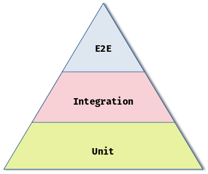

# The Venn of Angular Component Testing: Benefits & summary

If you haven't read the previous parts of this series, please take a look otherwise what's to follow may not make too much sense.

## The Venn Diagram of Angular Component Testing

This brings us to the heart of this series. Going back to the [definition for an Integration Test from part 1 of this series](./venn-of-angular-component-testing-0.md#a-definition-of-an-integration-test):

> [an Integration Test] Asserts a unit of software interacts as expected **with another**

After what I've previously highlighted with Sociable Tests, I think Sociable, Angular Component Tests are actually just a type of *Integration Test*. At the very least there is a significant overlap. Given this, **we should treat and expect Sociable / Component DOM tests to behave as Integration Tests**: they are more fragile & slower.

I'm sure if you've got this far though the series, then you are familiar with the [Testing Pyramid](https://www.smashingmagazine.com/2023/09/long-live-test-pyramid/)?



Here is my take on that but applying a similar principal to Angular, Component Testing.


This highlights the overlap between Unit & Integration Tests when it comes to testing Angular Components and how the 'grey area' of testing *is* the Sociable tests. It also emphasises the ratio (not to scale) of these types of tests I think we should be aiming for.

If I could change three conventions regarding the general testing approach we take in Angular applications, it would be to have:

1. ⏫ Have far more Solitary Unit Tests. Day-to-day I unfortunately see very few of these.

    ```typescript
    it('should test', () => {
      //arrange
      const component = new MyComponent();
      ...
      //act
      ...
      //assert
      expect(component...).toEqual(...);
    })
    ```
2. 🔼 More 'real' Integration Tests, that mimic real customer behaviour & interactions (using tools such as Playwright or Cypress).
3. ⏬ Fewer (near zero) Sociable / Component DOM Test Tests.
   1. Should push engineers to have any logic within the class rather than the template.
   2. If you have to have them, then call them out. Put them in separate `describe('IT Tests'){}` blocks or something similar (and limit the `TestBed` boilerplate to that block).

I think if an applications' test suite is organised in this way, it would lead to improved development practices. Engineers will lean more towards the [DRY](https://en.wikipedia.org/wiki/Don%27t_repeat_yourself) principal and smaller, more distinct components which have a [single responsibility](https://en.wikipedia.org/wiki/Single-responsibility_principle).

## Rebuttal

Given the 'Venn of Angular Component Testing' one could argue to simply just have a test suite of Sociable Tests, with no Solitary or Integration Tests. You absolutely *could*. I've not tried but I imagine, at scale it would become unmanageable. I would strongly expect too, that you will have a suite of Integration tests using something like [Playwright](https://playwright.dev) or [Cypress](https://learn.cypress.io/), so you'll end up duplicating your test effort.

## Closing

Think about why we test interactions in the DOM? I think we do it to test how the customer is going to use our component / application. We already use tools like [Playwright](https://playwright.dev) and [Cypress](https://learn.cypress.io/) for our E2E Testing[^1] which are probably better suited (and potentially less fragile than Sociable Tests) for this testing.

How many times have you faced problems in the past with writing your [Sociable] unit tests to assert something in the DOM and you just cannot get it to work, no matter how many `fixture.detectChanges()` you add? 😄 I know I've spent too much time down that rabbit hole when I know the code 'works'. It is probably quicker[^2] (and easier) to extend the existing E2E / Integration tests to cover the new behaviour. Plus, if there isn't any, observable change in the DOM, why bother including it in a Sociable Test at all?

Too often I see what could easily be Solitary Unit Tests written with all of the boilerplate of Sociable Tests without actually interacting with the Component Template. So the tests have none of the 'benefit' of a Sociable test but have all of the downsides of them. I've found by simply removing the `ComponentFixture` etc., the tests run up to 10x faster.

Final note: I was taught that if you're polluting the production code just so you can test something (think of the `data-testid` attribute for one, or even simply changing the scope of a method to make it 'easier' to test), then you maybe doing something wrong or unconventional.[^3]

[^1]: If you're not, then you should be. If you are performing *real* E2E tests against *real* APIs, then (👏) it shouldn't be too troublesome to reuse these tests to also execute against stubbed APIs (if you even need to bother).
[^2]: To write, not to run.
[^3]: That's a whole other conversation however.
